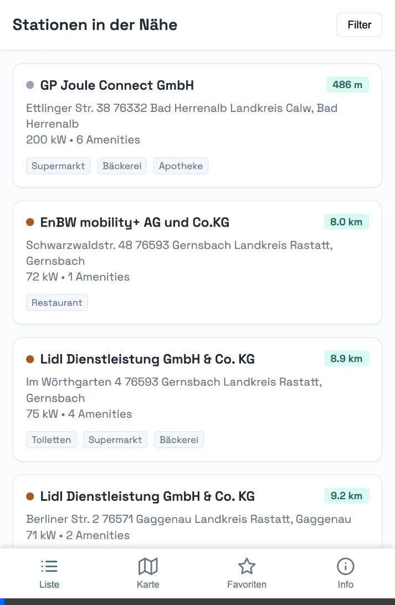

# woladen.de

Fast chargers in Germany with nearby amenities from OpenStreetMap.

## What This Repo Does

- Ingests the official Bundesnetzagentur charging registry.
  Source discovery starts from the BNetzA E-Mobilitaet start page (`Downloads und Formulare`) and selects the newest CSV/XLSX link.
- Filters to active chargers with at least `50 kW` nominal power.
- Enriches each charger with nearby amenities (`100m` radius) from OSM
  using either local `germany-latest.osm.pbf` or Overpass fallback.
- Publishes a mobile-ready static web map with filters (operator + amenities).
- Runs monthly via GitHub Actions on day 1 at `00:00 UTC` (`01:00 CET`).

## Project Structure

- `scripts/build_data.py`: End-to-end data pipeline.
- `scripts/build_site.py`: Creates deployable `site/` bundle.
- `web/`: Frontend app (Leaflet + vanilla JS/CSS/HTML).
- `data/`: Cached source and generated analytics outputs.
- `.github/workflows/daily-data-generation.yml`: Daily data generation + commit.
- `.github/workflows/pages-deploy.yml`: GitHub Pages build + deploy.

## GitHub Setup

1. In repository settings, set GitHub Pages source to `GitHub Actions`.
2. Ensure the default branch allows `github-actions[bot]` pushes (for generated artifacts).
3. Keep DNS for `woladen.de` pointed to GitHub Pages.

## Local Usage

Install dependencies:

```bash
python3 -m pip install -r requirements.txt
```

Build data:

```bash
python scripts/build_data.py \
  --min-power-kw 50 \
  --radius-m 100 \
  --amenity-backend osm-pbf \
  --osm-pbf-path data/germany-latest.osm.pbf \
  --download-osm-pbf
```

Overpass fallback:

```bash
python scripts/build_data.py \
  --min-power-kw 50 \
  --radius-m 100 \
  --amenity-backend overpass \
  --query-budget 500 \
  --refresh-days 30
```

Build site bundle:

```bash
python scripts/build_site.py
```

## Notes

- `--amenity-backend auto` (default) uses local `data/germany-latest.osm.pbf` if present, otherwise Overpass.
- `--query-budget`, `--refresh-days`, and `--overpass-delay-ms` only apply to the Overpass backend.
- If BNetzA fetch fails and no local cache exists, the pipeline fails intentionally.
- On first successful run, artifacts in `data/` are updated and committed by CI.

<!-- DATA_STATUS_START -->
## Data Build Status

- Last build (UTC): `2026-02-11T21:37:05+00:00`
- Source: `https://data.bundesnetzagentur.de/Bundesnetzagentur/DE/Fachthemen/ElektrizitaetundGas/E-Mobilitaet/Ladesaeulenregister_BNetzA_2026-01-28.csv`
- Fast chargers (>= 50.0 kW): `16485`
- Chargers with >=1 nearby amenity: `15006`
- Amenity backend: `osm-pbf`
- Live amenity lookups this run: `0` (cache hits: `0`, deferred: `0`)

Generated files:
- `data/bnetza_cache.csv`
- `data/chargers_fast.csv`
- `data/chargers_fast.geojson`
- `data/operators.json`
- `data/summary.json`
<!-- DATA_STATUS_END -->
