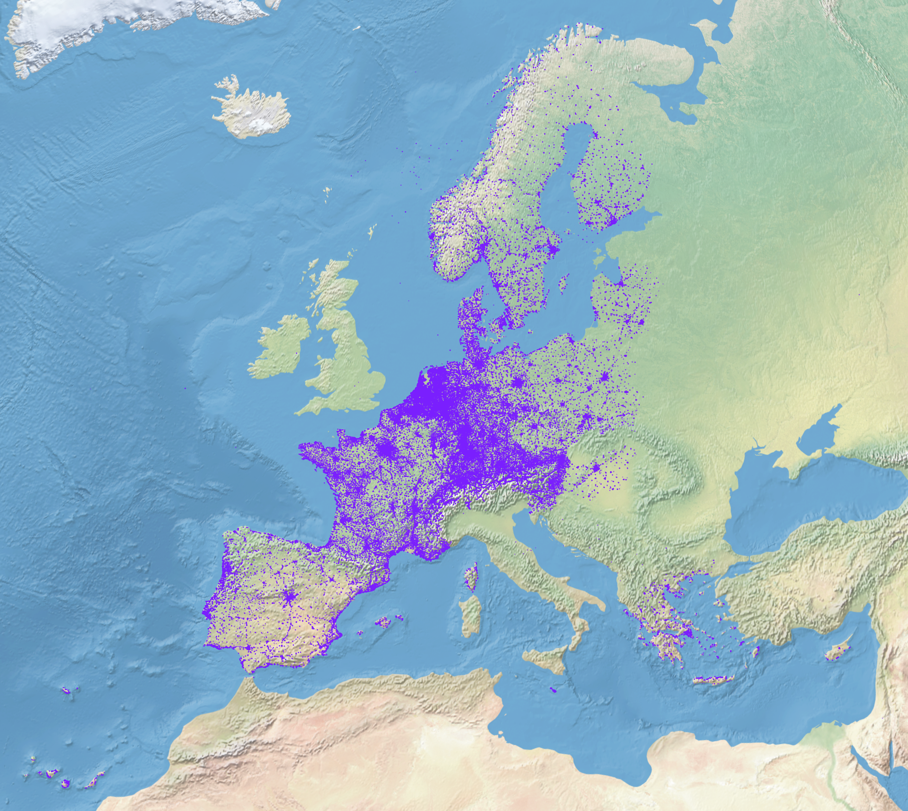

# woladen.de

## Data coverage



# About woladen.de
Purpose: **Find charging stations in Europe where charging your EV is fun.**

[woladen.de](https://woladen.de/) allows you to discover recharging stations in Europe. This repository builds an open static SQLite bundle for supported European AFIR/NAP charging infrastructure sources, plus Switzerland and Norway, for mobile/offline clients and the web app.

## What This Repo Does

- Builds an open static European charging bundle from national NAP/AFIR sources, public registries, and reviewed source-specific workarounds.
- Filters the European recharging stations depending on criteria, e.g. to active fast chargers with at least `50 kW` nominal power by default or certain nearby amenities.
- Enriches stations with nearby amenities from OpenStreetMap within a specified radius.
- Augments matched recharging stations with live occupancy from NAP DATEX II and OCPI data streams, where available.
- Exposes a live backend API for AFIR push/poll ingestion and station status at `https://live.woladen.de`.
- Publishes a mobile-ready static web map with filters (operator + amenities).
- Refreshes data daily from NAP sources via GitHub Actions at `01:00 UTC`.

## Project Structure

- `scripts/build_data.py`: End-to-end data pipeline.
- `scripts/build_site.py`: Creates deployable `site/` bundle.
- `scripts/build_eu_static_description_bundle.py`: Normalizes supported European static sources into bundle CSV rows.
- `scripts/build_open_static_sqlite_bundle.py`: Builds per-country and aggregate open-static SQLite bundle files.
- `scripts/build_open_static_regional_release_assets.py`: Builds regional mobile download packages and manifests.
- `scripts/build_onboarded_static_catalog.py`: Builds onboarded source seed catalogs for CH, NL, and BE.
- `backend/`: Live backend for DATEX ingestion, SQLite persistence, and FastAPI endpoints.
- `deploy/ionos/`: Packaging and install scripts for the IONOS VPS that serves `live.woladen.de`.
- `web/`: Frontend app (Leaflet + vanilla JS/CSS/HTML).
- `iphone/`: Native iPhone app (SwiftUI + MapKit).
- `android/`: Native Android app (Jetpack Compose + OSMDroid).
- `data/`: Cached source and generated analytics outputs.
- `.github/workflows/daily-data-generation.yml`: Daily data generation + commit.
- `.github/workflows/pages-deploy.yml`: GitHub Pages build + deploy.
- `.github/workflows/build-open-static-sqlite-bundle.yml`: Manual open-static SQLite/release bundle generation.
- `.github/workflows/build-onboarded-static-catalog.yml`: Manual or weekly onboarded static catalog artifact generation.

## Data Sources

The data product is built from the national NAP charging registry, and data published by CPOs on their NAP accounts. We consume AFIR static metadata, and consume live occupancy feeds where possible, and combine this with open data from OpenStreetMap for amenities.

The open static bundle currently supports these country sources:

| Country | Primary source used by the bundle |
| --- | --- |
| AT | E-Control DATEX energy infrastructure table publication |
| BE | EnergyVision OCPI locations, Road OCPI locations, Group INDIGO DATEX static data, and Monta AFIR charge-point table |
| CH | Swiss BFE Ladestationen static OICP JSON |
| CY | Traffic4Cyprus/FixCyprus DATEX II chargers |
| CZ | MPO public charging-station register XLSX |
| DE | `woladen.de` Bundesnetzagentur-derived static bundle rows |
| DK | Monta AFIR charge-point table |
| ES | DGT electrolineras DATEX II static charging infrastructure |
| FI | Digitraffic DATEX locations |
| FR | Base nationale IRVE static consolidation |
| GR | Electrokinisi IDRO static charging-station JSON ZIP |
| HU | NAP subscription DATEX II static snapshots for Eco-Movement and MVM Mobiliti |
| LT | Via Lietuva DATEX II public charging infrastructure table, with tracked static fallback during backend challenge periods |
| LU | Public electrical charging stations WFS GeoJSON |
| LV | Transportdata Eco-Movement and LVC DATEX energy infrastructure snapshots |
| MT | Transport Malta eGIS Charging Points ArcGIS layer |
| NL | NDW OCPI locations |
| NO | NOBIL API v3 static charging-station datadump |
| PL | EIPA reader static JSON files, with browser pages as fallback evidence |
| PT | MOBI.E DATEX II v3 Energy Infrastructure Table Publication |
| SE | NOBIL API v3 static charging-station datadump |
| SI | NAP Prometej IDACS Energy Infrastructure Table Publication |
| OSM | OpenStreetMap/Geofabrik PBFs for nearby amenities |

## Bundle Coverage

Counts below are from the `open-static-ios-regional-latest` SQLite bundle. `Fast chargers` counts charger rows with `max_power_kw >= 50`; `Fast chargers with amenities` counts those charger rows when the associated station has at least one nearby amenity.

| Country | Stations | Chargers | Fast chargers | Fast chargers with amenities |
| --- | ---: | ---: | ---: | ---: |
| AT | 14,660 | 38,771 | 10,518 | 9,223 |
| BE | 5,804 | 17,232 | 389 | 249 |
| CH | 8,671 | 18,745 | 4,303 | 4,068 |
| CY | 100 | 171 | 11 | 6 |
| CZ | 3,755 | 6,594 | 2,438 | 2,150 |
| DE | 72,155 | 197,527 | 45,008 | 41,549 |
| DK | 3,379 | 13,469 | 1,963 | 1,787 |
| ES | 12,241 | 36,446 | 11,382 | 9,466 |
| FI | 3,673 | 19,444 | 5,556 | 5,350 |
| FR | 63,775 | 159,693 | 44,877 | 40,356 |
| GR | 3,977 | 9,254 | 1,569 | 1,128 |
| HU | 1,343 | 2,520 | 686 | 586 |
| LT | 2,496 | 13,814 | 2,767 | 2,112 |
| LU | 530 | 530 | 17 | 17 |
| LV | 1,102 | 3,203 | 1,814 | 1,705 |
| MT | 184 | 184 | 32 | 30 |
| NL | 61,282 | 157,485 | 6,258 | 4,700 |
| NO | 5,176 | 32,681 | 15,122 | 13,306 |
| PL | 6,600 | 13,070 | 5,598 | 4,286 |
| PT | 7,978 | 19,340 | 7,138 | 6,505 |
| SE | 8,922 | 61,118 | 11,797 | 10,351 |
| SI | 1,191 | 3,412 | 542 | 500 |
| **Total** | **288,994** | **824,703** | **179,785** | **159,430** |

The generated `source_attribution.json` records source URLs, source UIDs, license review status, static/dynamic boundaries, and credential handling. Treat that file as the bundle's machine-readable attribution contract.

## GitHub Setup

1. In repository settings, set GitHub Pages source to `GitHub Actions`.
2. Ensure the default branch allows `github-actions[bot]` pushes (for generated artifacts).
3. Keep DNS for `woladen.de` pointed to GitHub Pages.

For the open-static bundle workflow, configure the source credentials as GitHub Actions secrets when the corresponding countries are included:

- `AT_ECONTROL_API_KEY`, optional `AT_ECONTROL_REFERER`, and optional `AT_LADESTELLEN_USER` / `AT_LADESTELLEN_PASSWORD`
- `TRANSPORTDATA_BE_ENERGYVISION_PROD_TOKEN` and `TRANSPORTDATA_BE_ENERGYVISION_PROD_TOKEN_C`
- `MONTA_PUBLIC_CLIENT_ID` / `MONTA_PUBLIC_CLIENT_SECRET`, or the `DK_MONTA_CLIENT_ID` / `DK_MONTA_CLIENT_SECRET` aliases
- `PL_EIPA_READER_TOKEN`
- `NO_SE_NOBIL_KEY`
- `SI_NAP_EMAIL` / `SI_NAP_PASSWORD`
- `PT_NAP_PASSWORD`
- `HU_NAP_EMAIL` / `HU_NAP_PASSWORD`
- `TRANSPORTDATA_LV_ECO_MOVEMENT_STATIC_API_KEY`
- `TRANSPORTDATA_LV_ECO_MOVEMENT_STATUS_PRICE_API_KEY`
- `TRANSPORTDATA_LV_LVC_EV_CHARGING_STREAM_API_KEY`

Local secret files belong under ignored `secret/` paths. Do not commit credentials, raw private payloads, or live deployment material.

## Backend Deployment

The static frontend and the live backend are deployed separately:

- `https://woladen.de`: static frontend
- `https://live.woladen.de`: FastAPI backend for AFIR dynamic data on chargers, receiving DATEX II v3 pull subscriptions from Mobilithek, where available

Backend docs:

- [backend/README.md](/Users/raphaelvolz/Github/woladen.de/backend/README.md)
- [deploy/ionos/README.md](/Users/raphaelvolz/Github/woladen.de/deploy/ionos/README.md)

Useful public backend endpoints:

- `GET https://live.woladen.de/healthz`
- `GET https://live.woladen.de/v1/status`

## Local Usage

Use Python 3.12. Create an isolated environment and install the base dependencies:

```bash
python3 -m venv .venv
source .venv/bin/activate
python3 -m pip install -r requirements.txt
```

Build the legacy Germany/Mobilithek data pipeline:

```bash
python3 scripts/build_data.py \
  --min-power-kw 50 \
  --radius-m 250 \
  --amenity-backend osm-pbf \
  --osm-pbf-path data/germany-latest.osm.pbf \
  --download-osm-pbf
```

Overpass fallback:

```bash
python3 scripts/build_data.py \
  --min-power-kw 50 \
  --radius-m 250 \
  --amenity-backend overpass \
  --query-budget 500 \
  --refresh-days 30
```

Build site bundle:

```bash
python3 scripts/build_site.py
```

Test the built web app locally against `https://live.woladen.de`:

```bash
python3 scripts/build_site.py
python3 -m http.server 4173 --directory site
```

Then open `http://localhost:4173/`.

Run the focused frontend checks after web changes:

```bash
node --test web/filtering.test.mjs web/location.test.mjs
```

## Open Static Bundle

Install the additional open-static dependencies when building European bundle artifacts:

```bash
python3 -m pip install -r requirements.txt -r requirements-open-static.txt
```

For local OSM/PBF enrichment or release-style compression, install the system tools too:

```bash
# macOS
brew install zstd osmium-tool

# Debian/Ubuntu
sudo apt-get update && sudo apt-get install -y zstd osmium-tool
```

The easiest supported path is the GitHub Actions workflow. It fetches source payloads, builds normalized CSV rows, builds per-country SQLite parts, aggregates them, checks row counts, and can publish/update the release assets:

```bash
gh workflow run build-open-static-sqlite-bundle.yml \
  --repo volzinnovation/woladen.de \
  --ref main \
  -f countries='AT,BE,CH,CY,CZ,DE,DK,ES,FI,FR,GR,HU,LT,LU,LV,MT,NL,NO,PL,PT,SE,SI' \
  -f release_tag='open-static-ios-regional-latest' \
  -f refresh_ch_nl_normalized=true \
  -f include_osm_pbf=false \
  -f download_osm_pbf=false \
  -f fail_on_pbf_missing=false \
  -f publish_release=true
```

Use `publish_release=false` for trial runs. The example above publishes a fast, non-enriched bundle; it is useful for checking the pipeline, but it is not byte-equivalent to the prior analytics release because non-DE OSM amenities are not populated.

For migration runs that need to reuse a prepared bundle artifact from another repository, set the source/reuse repository inputs and configure `OPEN_STATIC_ARTIFACT_READER_TOKEN` as a GitHub Actions secret when the artifact repository is private:

```bash
gh workflow run build-open-static-sqlite-bundle.yml \
  --repo volzinnovation/woladen.de \
  --ref main \
  -f countries='AT,BE,CH,CY,CZ,DE,DK,ES,FI,FR,GR,HU,LT,LU,LV,MT,NL,NO,PL,PT,SE,SI' \
  -f source_run_id='<analytics-source-run-id>' \
  -f source_run_repo='volzinnovation/Woladen.de-analytics' \
  -f amenity_reuse_run_id='<analytics-prepared-run-id>' \
  -f amenity_reuse_repo='volzinnovation/Woladen.de-analytics' \
  -f release_tag='open-static-ios-regional-latest' \
  -f include_osm_pbf=false \
  -f download_osm_pbf=false \
  -f fail_on_pbf_missing=false \
  -f publish_release=true
```

For a fresh enriched rebuild, set `include_osm_pbf=true` and `download_osm_pbf=true`; this is slower and can run for hours.

To build locally from already fetched source archives/caches, or after running the same `commercial_fetch_*` commands used by `.github/workflows/build-open-static-sqlite-bundle.yml`:

```bash
export COUNTRIES='AT,BE,CH,CY,CZ,DE,DK,ES,FI,FR,GR,HU,LT,LU,LV,MT,NL,NO,PL,PT,SE,SI'
export WOLADEN_COMMERCIAL_SQLITE_PATH=data/commercial_state.sqlite3
export WOLADEN_COMMERCIAL_RAW_PAYLOAD_DIR=data/commercial_raw

python3 scripts/build_onboarded_static_catalog.py \
  --output-dir data/onboarded_static \
  --country BE,NL,CH

python3 scripts/build_eu_static_description_bundle.py \
  --output-dir data/eu27_ch_static \
  --woladen-de-data-dir data \
  --onboarded-static-dir data/onboarded_static \
  --refresh-ch-nl-normalized

python3 scripts/validate_open_static_bundle.py \
  --bundle-dir data/eu27_ch_static \
  --normalized-only \
  --require-normalized-rows

mkdir -p tmp/open-static-parts tmp/open-static
for country in ${COUNTRIES//,/ }; do
  python3 scripts/build_open_static_sqlite_bundle.py country \
    --input-dir data/eu27_ch_static \
    --country "$country" \
    --output-path "tmp/open-static-parts/open-static-$country.sqlite3"
done

python3 scripts/build_open_static_sqlite_bundle.py aggregate \
  --parts-dir tmp/open-static-parts \
  --output-path tmp/open-static/open_static.sqlite3

python3 scripts/build_open_static_sqlite_bundle.py check-counts \
  --db-path tmp/open-static/open_static.sqlite3 \
  --expected-dir data/eu27_ch_static \
  --countries "$COUNTRIES"
```

Regional mobile release assets can be generated from the country parts:

```bash
python3 scripts/build_open_static_regional_release_assets.py \
  --parts-dir tmp/open-static-parts \
  --output-dir tmp/open-static-regional-packs \
  --github-owner volzinnovation \
  --github-repo woladen.de \
  --github-release-tag open-static-ios-regional-latest
```

The bundle workflow publishes:

- `open_static.sqlite3.zst`
- `open_static.sqlite3.zst.sha256`
- `open_static.sqlite3.sha256`
- `open-static-<GROUP>.sqlite3.zlib`
- `open-static-<GROUP>.sqlite3.zlib.sha256`
- `open-static-<GROUP>.sqlite3.sha256`
- `open-static-<GROUP>.manifest.json`
- `regional_pack_index.json`

The regional groups are `DACH`, `BENELUX`, `ROMANIC`, `NORDICS`, and `REST-EUROPE`.

## Workflow Notes

- `daily-data-generation.yml` refreshes station data and commits generated `data/` and README status changes.
- `pages-deploy.yml` builds and deploys only the static GitHub Pages site.
- `build-open-static-sqlite-bundle.yml` creates open-static bundle artifacts and, when requested, GitHub Release assets.
- `build-onboarded-static-catalog.yml` uploads `data/onboarded_static` as an artifact; it does not commit generated catalog files.
- `live-deploy.yml` deploys `live.woladen.de` and is separate from bundle generation.

## Notes

- `--amenity-backend auto` (default) uses local `data/germany-latest.osm.pbf` if present, otherwise Overpass.
- `--query-budget`, `--refresh-days`, and `--overpass-delay-ms` only apply to the Overpass backend.
- If BNetzA fetch fails and no local cache exists, the pipeline fails intentionally.
- On a successful data run, generated artifacts in `data/` and the data-status block below are updated and committed by CI.
- Treat `site/`, `data/eu27_ch_static/`, `data/onboarded_static/`, `data/osm_pbf_cache/`, `data/commercial_raw/`, and `data/commercial_archives/` as generated or cached outputs.

<!-- DATA_STATUS_START -->
## Data Build Status

- Last build (UTC): `2026-06-27T01:42:36+00:00`
- Source: `https://data.bundesnetzagentur.de/Bundesnetzagentur/DE/Fachthemen/ElektrizitaetundGas/E-Mobilitaet/Ladesaeulenregister_BNetzA_2026-06-03.xlsx`
- Full registry stations: `73224`
- Fast chargers (>= 50.0 kW): `15465`
- Fast chargers with live occupancy: `1480`
- Fast chargers with static AFIR details: `10167` (price: `8241`, opening hours: `11245`)
- Chargers with >=1 nearby amenity: `15465`
- Occupancy sources scanned: `33` (matched EVSEs: `6877`)
- Static AFIR sources used: `24` (helpdesk phones: `5816`)
- Amenity backend: `osm-pbf`
- Live amenity lookups this run: `0` (cache hits: `0`, deferred: `0`)

Generated files:
- `data/bnetza_cache.csv`
- `data/chargers_full.csv`
- `data/chargers_fast.csv`
- `data/chargers_fast.geojson`
- `data/chargers_under_50.geojson`
- `data/operators.json`
- `data/summary.json`
<!-- DATA_STATUS_END -->
