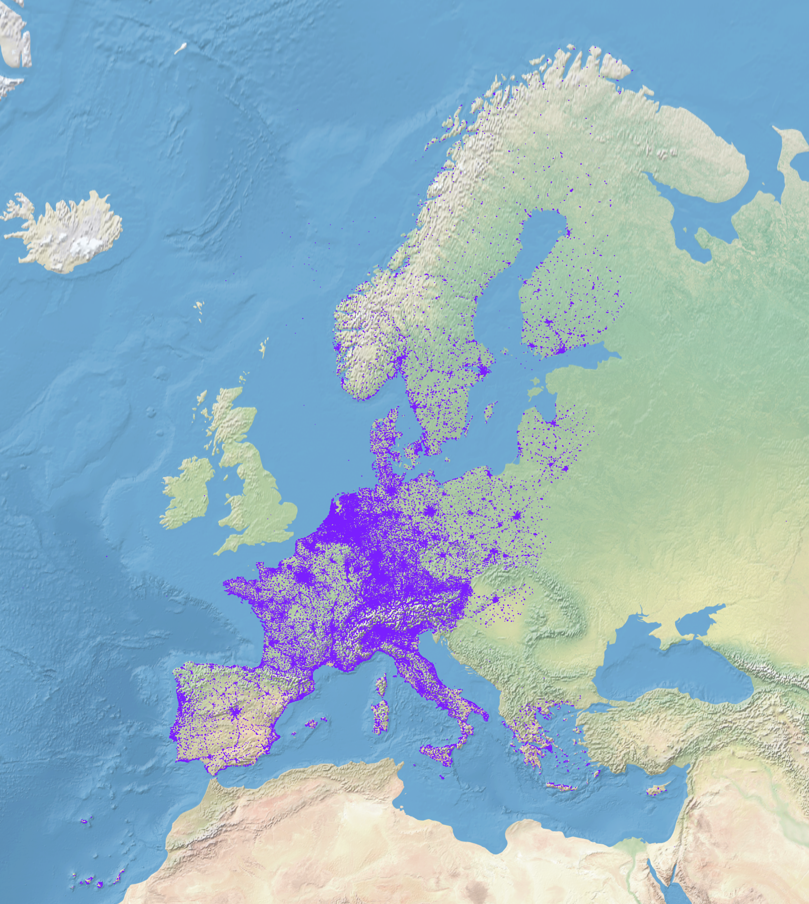

# woladen.de

# About woladen.de
Purpose: **Find charging stations in Europe where charging your EV is fun.** Fun is defined as: Stations should be reliable and available and humans have someting to do in the vicinity of the charger. Chargers are classified into Gold/Silver/Bronce depending on the number of amenities nearby-

[woladen.de](https://woladen.de/) allows you to discover recharging stations in Europe, we currently have data for 20+ countries and aim to pick up national data sources, as soon as they become available ( AFIR is in effect since Apr 2026, but adoption is slow in some countries).

This repository contains the public web frontend, native app source trees, and frontend/app assets. Backend ingestion, deployment, provider configuration, open-static bundle generation, analytics, and management reporting live in the private sister repository `volzinnovation/Woladen.de-analytics` (and is not open source).

## Current data coverage



Our aim is cover all of EU27 (subject to AFIR regulation), CH and NO.

## What This Repo Does

- Finds European recharging stations depending on user criteria
- Augments stations with nearby amenities, e.h. Restaurants, etc., such that humans have something to do while charging the car.
- The commercial backend provides AFIR live status data from the various NAP in the EU and national open data providers.
- Displays live occupancy from `https://live.woladen.de` and `https://live-eu.woladen.de`, where available.
- Includes a web charging-stop planner that matches visible stations to a planned stop duration and needed kWh.
- Ships an installable PWA shell with conservative static caching; live, API, and data feeds remain network-first.
- Provides web, iPhone and Android app source and assets. Web site works perfectly fine, e.g. on a Tesla or NIO in-car browser.

## Project Structure

- `scripts/build_site.py`: Creates deployable `site/` bundle.
- `web/`: Frontend app (Leaflet + vanilla JS/CSS/HTML).
- `iphone/`: Native iPhone app (SwiftUI + MapKit).
- `android/`: Native Android app (Jetpack Compose + OSMDroid).
- `data/`: Generated frontend contract data consumed by web/native builds.
- `docs/`: Technical plans, native app notes, audits, and historical project docs.
- `site/`: Generated locally by `scripts/build_site.py` and deployed by GitHub
  Pages; it is intentionally ignored by git.
- `output/` and `test-results/`: Local generated screenshots, release assets,
  reports, and test artifacts; they are intentionally ignored by git.
- `.github/workflows/pages-deploy.yml`: GitHub Pages build + deploy.

## Data Sources

The data product is built from the national NAP charging registry, and data published by CPOs on their NAP accounts. We consume AFIR static metadata, and consume live occupancy feeds where possible, and combine this with open data from OpenStreetMap for amenities.

The open static bundle currently supports these country sources:

| Country | Primary source used by the bundle |
| --- | --- |
| AT | E-Control DATEX energy infrastructure table publication |
| BE | EnergyVision OCPI locations, Road OCPI locations, Group INDIGO DATEX static data, and Monta AFIR charge-point table |
| CH | Swiss BFE Ladestationen static OICP JSON |
| CY | Traffic4Cyprus/FixCyprus DATEX II chargers |
| CZ | MPO public charging-station register XLSX |
| DE | `woladen.de` Bundesnetzagentur-derived static bundle rows |
| DK | Monta AFIR charge-point table |
| ES | DGT electrolineras DATEX II static charging infrastructure |
| FI | Digitraffic DATEX locations |
| FR | Base nationale IRVE static consolidation |
| GR | Electrokinisi IDRO static charging-station JSON ZIP |
| HU | NAP subscription DATEX II static snapshots for Eco-Movement and MVM Mobiliti |
| IT | PUN public web-app signed static charging API aggregate |
| LT | Via Lietuva DATEX II public charging infrastructure table, with tracked static fallback during backend challenge periods |
| LU | Public electrical charging stations WFS GeoJSON |
| LV | Transportdata Eco-Movement and LVC DATEX energy infrastructure snapshots |
| MT | Transport Malta eGIS Charging Points ArcGIS layer |
| NL | NDW OCPI locations |
| NO | NOBIL API v3 static charging-station datadump |
| PL | EIPA reader static JSON files, with browser pages as fallback evidence |
| PT | MOBI.E DATEX II v3 Energy Infrastructure Table Publication |
| SE | NOBIL API v3 static charging-station datadump |
| SI | NAP Prometej IDACS Energy Infrastructure Table Publication |
| OSM | OpenStreetMap/Geofabrik PBFs for nearby amenities |

## Bundle Coverage

Counts below are from `data/open_static_summary.json`, generated from the aggregate `open-static-ios-regional-latest` SQLite bundle. `Fast stations` counts station rows with `max_power_kw >= 50`.

| Country | Stations | Chargers | Fast stations |
| --- | ---: | ---: | ---: |
| AT | 14,661 | 38,771 | 3,435 |
| BE | 4,219 | 12,907 | 112 |
| CH | 8,670 | 18,725 | 1,217 |
| CY | 100 | 171 | 11 |
| CZ | 3,755 | 6,594 | 1,878 |
| DE | 72,155 | 197,527 | 16,633 |
| DK | 3,396 | 13,533 | 503 |
| ES | 12,237 | 36,432 | 5,441 |
| FI | 3,674 | 19,430 | 1,254 |
| FR | 63,728 | 159,613 | 11,911 |
| GR | 3,975 | 9,250 | 718 |
| HU | 1,346 | 2,523 | 372 |
| IT | 27,339 | 69,679 | 7,022 |
| LT | 2,496 | 13,814 | 760 |
| LU | 530 | 530 | 17 |
| LV | 1,102 | 3,203 | 772 |
| MT | 184 | 184 | 32 |
| NL | 61,244 | 157,380 | 1,408 |
| NO | 5,175 | 32,672 | 1,924 |
| PL | 6,600 | 13,070 | 2,961 |
| PT | 7,978 | 19,340 | 3,018 |
| SE | 8,922 | 61,108 | 2,218 |
| SI | 1,191 | 3,405 | 186 |
| **Total** | **314,677** | **889,861** | **63,803** |

The generated `source_attribution.json` records source URLs, source UIDs, license review status, static/dynamic boundaries, and credential handling. Treat that file as the bundle's machine-readable attribution contract.

## GitHub Setup

1. In repository settings, set GitHub Pages source to `GitHub Actions`.
2. Ensure the default branch allows `github-actions[bot]` pushes (for generated artifacts).
3. Keep DNS for `woladen.de` pointed to GitHub Pages.

Provider credentials, source credentials, raw private payloads, live deployment
material, and backend deploy secrets belong in `Woladen.de-analytics`.

## Backend Boundary

The static frontend and live backends are deployed separately:

- `https://woladen.de`: static frontend from this repository
- `https://live.woladen.de`: Germany/Mobilithek backend from
  `Woladen.de-analytics`
- `https://live-eu.woladen.de`: EU catalog/routing backend from
  `Woladen.de-analytics`

Useful backend smoke endpoints:

- `GET https://live.woladen.de/healthz`
- `GET https://live-eu.woladen.de/healthz`

## Local Usage

Use Python 3.12. Create an isolated environment and install the base dependencies:

```bash
python3 -m venv .venv
source .venv/bin/activate
python3 -m pip install -r requirements.txt
```

Build site bundle:

```bash
python3 scripts/build_site.py
```

Test the built web app locally against `https://live.woladen.de`:

```bash
python3 scripts/build_site.py
python3 -m http.server 4173 --directory site
```

Then open `http://localhost:4173/`.

Run the focused frontend checks after web changes:

```bash
node --test web/filtering.test.mjs web/location.test.mjs
```

## Workflow Notes

- `pages-deploy.yml` builds and deploys only the static GitHub Pages site.
- Backend/data/bundle/deploy workflows live in private `Woladen.de-analytics`.
- Native app notes live in `docs/android.md` and `docs/iphone.md`.

## Notes

- Rebuild and smoke-test generated `site/` after web changes, but do not commit
  the generated bundle.
- Keep user-facing docs/help in German and technical docs in English.
- If BNetzA fetch fails and no local cache exists, the pipeline fails intentionally.
- On a successful data run, generated artifacts in `data/` and the data-status block below are updated and committed by CI.
- Treat `site/`, `output/`, `test-results/`, `data/eu27_ch_static/`, `data/onboarded_static/`, `data/osm_pbf_cache/`, `data/commercial_raw/`, and `data/commercial_archives/` as generated or cached outputs.

<!-- DATA_STATUS_START -->
## Data Build Status

- Last build (UTC): `2026-06-28T01:46:27+00:00`
