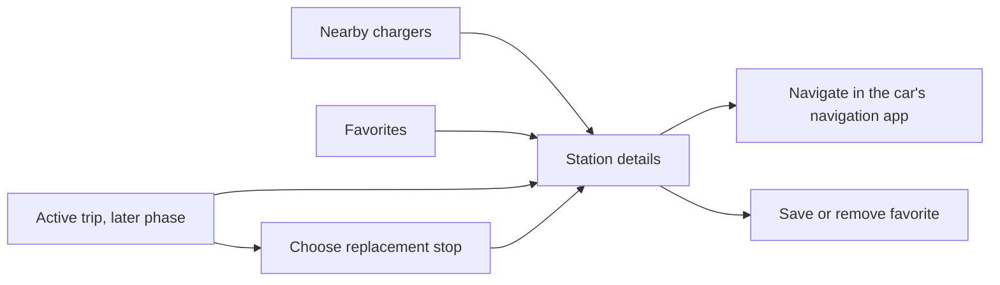

# Android / iPhone parity investigation

Date: 2026-09-14. Scope: current source on `main`, including the pre-existing uncommitted native changes. This is an implementation assessment and release plan, not confirmation of the features distributed through either app store.

## Implementation status

The first milestone described here is now implemented in the Android source:

- AndroidX Car App 1.7.0 is configured with the POI service, map-template
  capability, production host validation, and API 36 target.
- Android Auto has nearby and favorite charger screens, live status enrichment,
  station details, shared phone filters/favorites, location permission handling,
  and navigation handoff through `geo:`.
- Android CI now runs lint, unit tests, and a debug APK build.

The persistent route/energy/Fahrt domain, widgets/deep links, and traffic-aware
ETA remain the follow-on work described below; this milestone does not claim
full iPhone feature parity for those areas.

## Recommendation

Build Android Auto as an Android for Cars **point-of-interest (POI)** experience inside the existing Android app. First deliver nearby chargers, favorites, station details and navigation handoff. Then connect it to a port of the iPhone's persistent route plans, energy planning and Fahrt mode.

The existing Android browsing product is a useful foundation. The largest gaps are the trip domain and platform integrations, rather than the basic list/map/filter screens. Full parity also includes widgets and traffic-aware ETA. The Android Auto MVP can proceed before those are complete.

Google supports charging discovery under the POI category; the older CHARGING category is deprecated. Its POI templates support a host-rendered map, so the initial car experience can use that map without building a separate car map renderer. [Google POI guide](https://developer.android.com/training/cars/apps/poi)

## What is already present, and what is missing

References below point to the inspected working-tree source. Source behavior takes precedence over older documentation.

| Capability | iPhone baseline | Android status | Required work |
| --- | --- | --- | --- |
| Charger discovery | List, map, search, filters, live status and adaptive layouts | Substantially present | Preserve behavior and compare representative phone/tablet flows. |
| Favorites and station details | Categories, route-to-favorites, amenity map, EVSE status, price and contact/navigation actions | Substantially present | Add the trip-target actions described below; avoid rebuilding existing functionality. |
| Optional station history | Reliability percentage and last-unavailable timestamp, when supplied | Missing from Android station model/detail UI | Carry through the optional API fields and display them only when available. |
| Basic route search | Origin/destination, route chargers, map and filtering | Present | Reuse the existing route response and station identifiers. |
| Persistent route plans | Save, edit, reopen, recalculate, delete, select stops and start a route | Missing; route data is ViewModel/UI state | Port route models, persistence and editor semantics. Saving route chargers as favorites is already available, but does not persist a trip plan. |
| Energy planning | Named vehicle profiles, battery capacity, consumption, average charging power, initial/reserve/target SOC, charging windows and provider coverage/preference | Missing | Port the deterministic planner and its tests, then add the phone controls. |
| Fahrt mode | Dedicated driving view with three layouts, next stop, progress, ETA, projected arrival SOC, complete/skip/replace and end trip | Missing | Port the trip state machine and phone views. |
| Single-station trip | Select a nearby/favorite station as the active target without planning a full route | Missing | Persist the target and expose it to phone, car and widget. |
| In-car UI | Substantial CarPlay charging implementation | No Android Auto integration | Add service, session, templated screens, host navigation and car lifecycle handling. |
| Widgets/deep links | Small/medium home-screen widget, nearest matching charger or active target; links to a station, planning mode or active trip | Missing | Add Android widget, refresh scheduling, station links and mode entry. |
| Traffic-aware ETA | MapKit calculation, including remaining stops and estimated charging time | No equivalent service | Confirm an available traffic-capable API/provider; distinguish this from a route-duration estimate. |
| Search implementation | MapKit address/POI completion | Android Geocoder suggestions, embedded in UI code | Extract search behind an interface and validate equivalent destination discovery; exact provider results will differ. |

Core evidence:

- Android root and adaptive layouts: [WoladenAppScreen.kt](/Users/raphaelvolz/Github/woladen.de/android/app/src/main/java/de/woladen/android/ui/WoladenAppScreen.kt:69). Existing favorite metadata/categories: [FavoritesStore.kt](/Users/raphaelvolz/Github/woladen.de/android/app/src/main/java/de/woladen/android/store/FavoritesStore.kt:26).
- Android route UI state: [RouteTabView.kt](/Users/raphaelvolz/Github/woladen.de/android/app/src/main/java/de/woladen/android/ui/RouteTabView.kt:109). Route API: [LiveApiClient.kt](/Users/raphaelvolz/Github/woladen.de/android/app/src/main/java/de/woladen/android/service/LiveApiClient.kt:142).
- iPhone Plan/Fahrt entry: [RootTabView.swift](/Users/raphaelvolz/Github/woladen.de/iphone/Woladen/App/RootTabView.swift:11). Saved routes/editor: [RoutePlanViews.swift](/Users/raphaelvolz/Github/woladen.de/iphone/Woladen/Views/RoutePlanViews.swift:4). Vehicle settings: [TripSettingsView.swift](/Users/raphaelvolz/Github/woladen.de/iphone/Woladen/Views/TripSettingsView.swift:81).
- iPhone trip persistence and transitions: [TripStore.swift](/Users/raphaelvolz/Github/woladen.de/iphone/Woladen/Services/TripStore.swift:105). Energy calculations: [EnergyRoutePlanner.swift](/Users/raphaelvolz/Github/woladen.de/iphone/Woladen/Services/EnergyRoutePlanner.swift:5). Driving UI: [TripView.swift](/Users/raphaelvolz/Github/woladen.de/iphone/Woladen/Views/TripView.swift:186).
- Widget families: [WoladenWidget.swift](/Users/raphaelvolz/Github/woladen.de/iphone/WoladenWidget/WoladenWidget.swift:378). Deep links: [WoladenApp.swift](/Users/raphaelvolz/Github/woladen.de/iphone/Woladen/App/WoladenApp.swift:92).
- Optional station history: [iPhone detail fields](/Users/raphaelvolz/Github/woladen.de/iphone/Woladen/Views/StationDetailView.swift:378), [Android station model](/Users/raphaelvolz/Github/woladen.de/android/app/src/main/java/de/woladen/android/model/ChargerModels.kt:68). Actual backend population of these optional fields was not verified.
- Search providers: [Android route suggestions](/Users/raphaelvolz/Github/woladen.de/android/app/src/main/java/de/woladen/android/ui/RouteTabView.kt:949), [iPhone completion](/Users/raphaelvolz/Github/woladen.de/iphone/Woladen/Services/PlaceSearchCompleter.swift:18).

## The actual CarPlay target

The iPhone implementation already provides:

- Nearby discovery using phone filters, live availability hydration, a 20 km search and up to 12 ranked stations.
- Station information: availability, price, freshness, power, estimated charging time/vehicle fit, EVSE details and nearby amenities/opening hours.
- Selecting a station into shared trip state; displaying the next planned stop with ETA, distance and projected SOC when available.
- Replacing the next stop with an earlier/on-route or detour alternative, with confirmation.
- Connection/disconnection handling, location validation, periodic refresh and permission/no-result states.

Evidence: [nearby discovery](/Users/raphaelvolz/Github/woladen.de/iphone/Woladen/App/CarPlaySceneDelegate.swift:680), [station detail and selection](/Users/raphaelvolz/Github/woladen.de/iphone/Woladen/App/CarPlaySceneDelegate.swift:902), [replacement flow](/Users/raphaelvolz/Github/woladen.de/iphone/Woladen/App/CarPlaySceneDelegate.swift:1343), [lifecycle](/Users/raphaelvolz/Github/woladen.de/iphone/Woladen/App/CarPlaySceneDelegate.swift:540).

CarPlay navigation hands off to Apple Maps. Its filter and vehicle settings entries are informational; editing happens on the phone. Richer detail rendering is gated to iOS 26.4+, with older template fallbacks. Android should preserve the tasks and information hierarchy using its own supported templates. [Navigation handoff](/Users/raphaelvolz/Github/woladen.de/iphone/Woladen/App/CarPlaySceneDelegate.swift:1337), [settings entries](/Users/raphaelvolz/Github/woladen.de/iphone/Woladen/App/CarPlaySceneDelegate.swift:791)

The EV charging entitlement is declared, but Apple entitlement approval and production CarPlay availability were not verified. Likewise, the source contains home-screen widgets, not a Live Activity implementation. Those are the limits of the comparison. [iPhone entitlement](/Users/raphaelvolz/Github/woladen.de/iphone/Woladen/Woladen.entitlements:5)

## Android Auto implementation

### First release: find a charger from the car

Proposed flow:

Use `PlaceListMapTemplate` for nearby/favorite stations with a host-rendered map. Show distance, power, available/total points and a compact amenity summary. Use a short station-detail template with navigation and favorite actions. Treat host content limits as authoritative; the iPhone's 12-row limit is not a portable Android limit. Keep complex route and vehicle editing on the phone. If a future design needs an app-rendered map, evaluate `MapWithContentTemplate` then. [POI map options](https://developer.android.com/training/cars/apps/poi)

Ship as an extension of the existing phone app. Android Auto projects an experience from the phone; Android Automotive OS is a separate in-vehicle installation/distribution target and should be a later scope decision. [Android for Cars overview](https://developer.android.com/training/cars)

Required wiring:

1. Add the Car App Library. The official release page currently lists **1.7.0 stable**, 1.8.0-rc01 and 1.9.0-alpha02. Use stable `androidx.car.app:app:1.7.0`; add `app-projected` for projection/hardware APIs actually used and `app-testing` for tests. [Release notes](https://developer.android.com/jetpack/androidx/releases/car-app)
2. Add `WoladenCarAppService`, a `Session` and screen classes. Declare the exported service with the CarAppService action and `androidx.car.app.category.POI`; declare `androidx.car.app.MAP_TEMPLATES` for map templates. [POI manifest requirements](https://developer.android.com/training/cars/apps/poi)
3. Add the `com.google.android.gms.car.application` metadata and `res/xml/automotive_app_desc.xml` with the `template` capability. [Android Auto setup](https://developer.android.com/training/cars/apps/auto)
4. Declare `androidx.car.app.minCarApiLevel` and guard optional newer host APIs at runtime. Android OS API level, Car App Library version and negotiated Car App API level are separate compatibility dimensions. [Library fundamentals](https://developer.android.com/codelabs/car-app-library-fundamentals)
5. Implement production host validation; allow-all validation belongs only in debug builds. [CarAppService host validation](https://developer.android.com/reference/androidx/car/app/CarAppService#createHostValidator())
6. Use `CarContext.startCarApp` with `ACTION_NAVIGATE` and a supported coordinate URI such as `geo:lat,lon`. Handle unsuccessful handoff. The current Android detail screen's phone URL launcher needs a separate car adapter. [CarContext navigation](https://developer.android.com/reference/androidx/car/app/CarContext#startCarApp(android.content.Intent)), [current phone actions](/Users/raphaelvolz/Github/woladen.de/android/app/src/main/java/de/woladen/android/ui/StationDetailSheet.kt:747)

No new backend endpoint is evident for this first release: the app already has catalog search/detail, live lookup/detail and favorites persistence. Continue using `https://live-eu.woladen.de` for catalog/live data, EU + Switzerland + Norway coverage, the 50 kW default threshold and 250 m amenity radius.

### Shared state is the prerequisite

The implementation now keeps the live API client, charger repository, favorites
store and persisted filter view in `WoladenApplication`. `MainActivity`,
`AppViewModel` and the car session therefore share catalog caches and phone/car
favorite and filter state while keeping presentation state separate. The later
trip port still needs an application-level trip store. [MainActivity](/Users/raphaelvolz/Github/woladen.de/android/app/src/main/java/de/woladen/android/MainActivity.kt:28), [AppViewModel](/Users/raphaelvolz/Github/woladen.de/android/app/src/main/java/de/woladen/android/viewmodel/AppViewModel.kt:110), [application services](/Users/raphaelvolz/Github/woladen.de/android/app/src/main/java/de/woladen/android/app/WoladenApplication.kt:8)

Keep subscriptions and network/location work scoped to active consumers, not
merely to the lifetime of the application singleton. Retain bounded caches and
coalesce requests for the same station.

Favorites currently load preferences into instance-local Compose state. Use a shared observable source so edits appear immediately on both displays; preserve the existing v2 data and migration. Persist active target/route state so process recreation can restore it. [FavoritesStore](/Users/raphaelvolz/Github/woladen.de/android/app/src/main/java/de/woladen/android/store/FavoritesStore.kt:26)

Location needs an early device spike: launch from the car with the phone Activity absent, phone locked, permission denied, approximate location and a stale last fix. Start/stop subscriptions with the car session, and validate background behavior against the chosen Android implementation before deciding whether any foreground-service changes are necessary. Do not add broad background permissions by assumption. The present location lifecycle is owned by the phone screen. [LocationService](/Users/raphaelvolz/Github/woladen.de/android/app/src/main/java/de/woladen/android/service/LocationService.kt:114)

Use `CarContext.requestPermissions` when required; on Android Auto the permission dialog appears on the phone. Provide an appropriate safe-to-check-phone message and a useful denied state. [Car permission handling](https://developer.android.com/training/cars/apps/library/request-permissions)

### Second release: trip-aware car view

Once Android has persistent trip/energy state, expose the active stop, progress, ETA, estimated arrival SOC, live availability and a short replacement flow in the car. Changes made on either display must affect the same trip. Preserve a standalone station target with unknown arrival SOC when no meaningful energy projection exists.

Port the domain semantics from Swift into testable Kotlin: route ordering, stop eligibility, energy windows, provider constraints, activation, completion, skipping and replacement. Add the corresponding phone views faithfully to the existing product design. Cross-check current web semantics when implementing; this repository's policy keeps web as the feature/design reference.

Two distinctions affect scope:

- **Traffic ETA requires another implementation.** iPhone calls MapKit's `MKDirections.calculateETA()`. Android currently exposes `/v1/routes/chargers`, which is not evidence of a traffic-aware ETA service. Verify the analytics repository/API capability first. A route-duration estimate can ship earlier with an explicit estimate label, but does not close this parity gap. Any new server proxy/provider integration belongs in `Woladen.de-analytics`. [iPhone ETA provider](/Users/raphaelvolz/Github/woladen.de/iphone/Woladen/Services/TripETAService.swift:129), [base calculation](/Users/raphaelvolz/Github/woladen.de/iphone/Woladen/Services/TripETAService.swift:6)
- **Vehicle telemetry is optional.** iPhone uses manual vehicle/SOC assumptions. Android's car hardware API can expose energy/location data, but availability and permissions vary; missing data must be handled. Keep manual settings as the parity baseline. [Car hardware APIs](https://developer.android.com/training/cars/apps/library/car-hardware-api)

A Woladen turn-by-turn engine would be an additional product project. Google's navigation category brings navigation-specific requirements, including navigation intents and simulation. It is unnecessary to reproduce the existing CarPlay handoff behavior. [Navigation app requirements](https://developer.android.com/training/cars/apps/navigation)

## Release prerequisites and validation

The Android build uses Kotlin 1.9.24, Compose, **MapLibre 12.3.1**, AndroidX Car App 1.7.0, AGP 8.5.2 and Gradle 8.7. Its min/compile/target SDKs are now 26/36/36. Despite filenames and older docs mentioning OSMDroid, the current dependency is MapLibre. Signing support already exists. [App build](/Users/raphaelvolz/Github/woladen.de/android/app/build.gradle.kts:35), [dependencies](/Users/raphaelvolz/Github/woladen.de/android/app/build.gradle.kts:103), [build plugin](/Users/raphaelvolz/Github/woladen.de/android/build.gradle.kts:2)

Since August 31, 2026, Google requires **API 36 for new phone apps and app updates**, subject to an applicable extension. Android Auto is delivered in the phone app, so the separate AAOS API-35 exception does not apply to this update. Upgrade compile/target SDK and the compatible build-tool combination, then test Android 16 behavior. The account's extension status was not inspected. [Google Play target API requirements](https://support.google.com/googleplay/android-developer/answer/11926878?hl=en)

Car quality requirements include completing tasks within five screens, responding to buttons within two seconds, and launch/content loading within ten seconds. Apply these to API-backed startup, including unavailable/slow-service behavior and driver-readable status. Stale availability must remain visibly stale and unknown availability must not be presented as free. [Car app quality](https://developer.android.com/docs/quality-guidelines/car-app-quality)

Recommended evidence before release:

- Existing Android unit tests and phone smoke flows pass; add route and trip scenarios currently absent from the smoke suite.
- Port meaningful cases from iPhone's [TripPlanningTests.swift](/Users/raphaelvolz/Github/woladen.de/iphone/WoladenTests/TripPlanningTests.swift:16), [CarPlay filtering/location cases](/Users/raphaelvolz/Github/woladen.de/iphone/WoladenTests/FilterMatchingTests.swift:90), and [widget selection cases](/Users/raphaelvolz/Github/woladen.de/iphone/WoladenTests/WidgetStationSelectionTests.swift:6).
- Test templates, navigation intents, permission handling and session transitions with the library testing helpers. [TestCarContext](https://developer.android.com/reference/kotlin/androidx/car/app/testing/TestCarContext), [SessionController](https://developer.android.com/reference/androidx/car/app/testing/SessionController)
- Run the Desktop Head Unit with a phone, then at least one real head unit. Cover cold launch, reconnect, phone locked, process recreation, day/night, different screen/input configurations, no location, slow/no network and live status changes. The DHU is Google's Android Auto head-unit emulator. [DHU testing](https://developer.android.com/training/cars/testing/dhu)
- Verify phone/car favorites and active target synchronization. When widgets arrive, verify exact-target links, stale display and restart restoration. Do not package a catalog fallback.
- Add Android CI for unit tests, lint and debug builds; current workflows only validate frontend/Python work. [Current CI](/Users/raphaelvolz/Github/woladen.de/.github/workflows/frontend-ci.yml:43)

For distribution, opt into Android Auto in Play Console and use a testing track. Current guidance lists no car form-factor review for internal testing, non-blocking review for closed testing, and blocking review for open testing/production. Prepare car screenshots and reviewer instructions. Because the catalog serves Europe, allow mock GPS so reviewers outside the region can test it. Recheck the privacy/data-safety declarations against the actual release behavior. [Distribution requirements](https://developer.android.com/training/cars/distribute)

Older [Android documentation](/Users/raphaelvolz/Github/woladen.de/docs/android.md:8) and [submission notes](/Users/raphaelvolz/Github/woladen.de/docs/android-play-console-submission.md:9) need an implementation-time update: they describe outdated map/tab and bundle-import behavior. They are not release evidence for the current code.

## Prioritized implementation backlog

These are proposed work packages, not tickets created in an external system. Effort ranges are engineering estimates from source inspection, not measured delivery commitments.

| Order | Work package | Completion criterion | Indicative effort |
| --- | --- | --- | --- |
| 1 | Build/release baseline | API 36-compatible build; existing tests and phone smoke flows pass | 2–4 developer-days |
| 2 | Shared stores and car lifecycle spike | Car cold-start works without phone Activity; favorites/filters are shared; location behavior verified | 3–5 days |
| 3 | Android Auto charger finder | Nearby + favorites + details + car navigation handoff; honest loading/error/freshness states | 7–10 days |
| 4 | Car validation and release preparation | DHU/real-device scenarios, host validation, review assets and testing-track readiness | 3–5 days |
| 5 | Saved plans and energy planner | Route persistence/editor, profiles, SOC/windows/provider constraints with shared test cases | 10–15 days |
| 6 | Phone Fahrt and trip-aware Auto | Single target, active route, progress, complete/skip/replace; phone/car synchronization | 8–13 days |
| 7 | Widgets, deep links and remaining phone parity | Nearby/active-target widget; exact station opening and planning/active-trip entry; search/settings/detail parity checks | 5–8 days |
| 8 | Full regression validation | Trip, car, phone/tablet, widget, lifecycle and localization scenarios | 3–5 days |
| Separate dependency | Traffic-aware ETA | Confirm API/provider and implement tested equivalent semantics | Estimate after API/provider investigation |

For one experienced Android engineer with device access, the ranges imply roughly **3–5 working weeks for the Android Auto charger-finder release**, and **8–13 working weeks total for the broader port**, excluding the unresolved traffic-ETA implementation and external review turnaround. Full parity can only be claimed once that ETA gap is also resolved. Phone trip work can run alongside the car work after shared interfaces stabilize.

Recommended first milestone: a signed test build in which the car can start woladen independently, find a matching charger, show credible availability/amenities and launch navigation. That is useful immediately and establishes the foundation for the remaining parity work.

## Investigation limits

Source and official documentation were reviewed. The Android source now passes
the debug lint, unit-test, and debug-APK build checks. Instrumentation tests,
Desktop Head Unit/real Android Auto runs, production API/ETA checks, and
Play/App Store account checks remain to be validated. Existing uncommitted
changes were preserved. No generated site/app artifacts were regenerated.
