# iOS-Fahrtmodus: Screenshot-Review

Screenshots: 23. Juli 2026 · Selbstaudit: 24. Juli 2026

## Testkontext

- Simulator: iPhone 16 Pro Max, iOS 18.6, deutsche Oberfläche
- Standort: Freiburg im Breisgau
- Beispielroute: Freiburg im Breisgau → Berlin
- Batteriestand beim Start: 80 %
- Fahrzeug: „Mein Auto“, 75 kWh, 18,0 kWh/100 km, 10 % Reserve
- Gewählte Ladestopps: Weiterstadt und Mönchenholzhausen
- Navigationsübergabe: S06/S07 zeigen Apple Maps; S13–S20 zeigen Google Maps
  (zwei bewusst getrennte Einstellungszustände)
- Favorisierte Station: Stark Energy GmbH, Freiburg im Breisgau

Die Kennungen `S01` bis `S20` bleiben stabil. Für die Review reicht daher
beispielsweise ein Kommentar wie:

> S13: Live-Status stärker hervorheben.
> S17: Karte sollte 20 % höher sein.

Alternativ können Kommentare direkt unter dem jeweiligen Screenshot ergänzt
werden.

## Selbsteinschätzung vor der Human Review

**Urteil:** Die grundlegende Produktausrichtung ist schlüssig, die Unterlage ist
aber noch keine vollständige Abnahmeunterlage. Die großen Entscheidungen
„Planen/Fahrt“, nächster Halt zuerst, sequenzielle Ladefenster, gespeicherte
Routenpräferenzen und ein einzelnes Stationsziel sind richtig. Einige sichtbare
Details schwächen jedoch die Fahrsicherheit und die Vergleichbarkeit. Außerdem
belegen S10–S12 nicht alle Aussagen, die der ursprüngliche Reviewtext ihnen
zugeschrieben hat.

### Entscheidungen, die ich beibehalten würde

1. **Planen/Fahrt als großer Umschalter:** Der Wechsel ist jetzt eine
   Produktentscheidung und keine kleine Navigationsebene.
2. **Station vor Karte im Fahrtmodus:** ETA, Live-Status, Ersatz und Navigation
   bleiben wichtiger als die Übersichtskarte.
3. **Durchgehender Klassifizierungsbalken:** Er lässt sich in Listen und im
   Routenverlauf schneller scannen als ein kleiner Punkt.
4. **Verkehrs-ETA unabhängig von externer Navigation:** MapKit liefert die
   Prognose in Woladen; Apple Maps oder Google Maps bleibt eine wählbare
   Übergabe.
5. **Sequenzielle Ladefenster:** Die nächste Stationsauswahl hängt korrekt von
   der vorherigen Auswahl ab.
6. **Gespeicherte Präferenzen statt eingefrorener Stopps:** Startort und
   Batteriestand müssen vor Abfahrt neu bewertet werden.
7. **Einzelne Station als Fahrtziel:** Das deckt spontane Fahrten ohne
   zusätzliches Endziel sauber ab.

### Vor der Human Review bereits gefundene Punkte

| Priorität | Evidenz | Selbstbefund | Konsequenz |
| --- | --- | --- | --- |
| Blocker Unterlage | S10 | Der Screenshot zeigt das erste Ladefenster und seine Kandidaten nicht. | Neu aufnehmen; bis dahin keine Freigabe der Kandidatenauswahl aus S10 ableiten. |
| Blocker Unterlage | S12 | Anbieterübersicht, vollständige Reihenfolge und „Fahrt starten“ liegen außerhalb des Bildes. | Zusätzlichen oberen und unteren Ausschnitt aufnehmen. |
| Hoch | S03 | Zuverlässigkeit, letzter Ausfall und materialisierte Auslastungsdaten sind im Stationsdetail nicht sichtbar. | Vor Abnahme ergänzen oder bewusst aus dem Scope nehmen. |
| Hoch | S13, S20 | „Ankunft“ bezeichnet sowohl Uhrzeit als auch Batteriestand; bei S20 kollidiert `100%` sichtbar mit der Entfernung. | Drittes Feld in „Akkustand bei Ankunft“ umbenennen und Layout korrigieren. |
| Hoch | S15 | Eine Ersatzstation zeigt weder zusätzlichen Umweg/ETA noch erwarteten Akkustand, Ladepunkte oder eine eindeutige Aktion „Übernehmen“. | Ersatzvergleich entscheidungsfähig machen. |
| Hoch | S14 | `amenity:toilets` ist ein nicht übersetzter Rohwert; der Linktitel wird abgeschnitten. | Taxonomie lokalisieren und Disclosure-Layout korrigieren. |
| Hoch | S01, S04, S05, S19 | Klassifizierungsbalken und Kartenpunkte verlassen sich stark auf Farbe; die Legende nennt die Stufen nicht ausdrücklich Gold/Silber/Bronze. | Stufe zusätzlich als Text/VoiceOver-Wert anbieten und Legende angleichen. |
| Mittel | S06, S17 | Die Einstellungsbeschreibung sagt „Route oberhalb des nächsten Halts“, S17 setzt richtigerweise die Station oberhalb der Karte. | Beschreibung in den Einstellungen korrigieren. |
| Mittel | S13, S16, S17 | `Unbekannt 0/2` kann wie „kein Ladepunkt frei“ gelesen werden. | „Status unbekannt · 2 Ladepunkte“ oder vergleichbar formulieren. |
| Mittel | S18, S19 | Neuberechnung wird nur durch ein Kreispfeil-Symbol erklärt. | Sichtbare Beschriftung „Start & Akku prüfen“ ergänzen. |
| Mittel | S04, S18, S19 | Starten, Neuberechnen und Löschen sind visuell überwiegend Symbolaktionen. | Text oder dauerhaft sichtbare Kurzlabels prüfen; VoiceOver separat testen. |

### Evidenzqualität

- **Gut belegt:** S01, S03–S09, S13–S20 zeigen jeweils einen stabilen,
  aussagekräftigen Zustand.
- **Nur teilweise belegt:** S11 zeigt die erste Wahl und den Beginn des zweiten
  Fensters, aber nicht dessen vollständige Kandidaten.
- **Nicht ausreichend belegt:** S10 und S12 müssen vor einer formalen
  Designfreigabe neu aufgenommen werden.
- **Nicht aus Screenshots ableitbar:** VoiceOver-Reihenfolge, Dynamic Type,
  Kontrastmesswerte, Minutentakt über längere Zeit, Bewegungsinferenz, Rückkehr
  aus externer Navigation und CarPlay.

## Abdeckung

| Bereich | Screenshots |
| --- | --- |
| Deutlicher Moduswechsel Planen/Fahrt | S01, S13, S20 |
| Stationsliste, Qualitätsbalken und Fahrtziel-Schaltfläche | S01 |
| Kartenansicht und Stationsdetails | S02, S03 |
| Favoriten, gespeicherte Routen und einzelnes Stationsziel | S04, S18–S20 |
| Info, Legende und Zugang zu Einstellungen | S05 |
| Fahrzeuge, Energie- und Fahrteinstellungen | S06 |
| Apple-Maps-/Google-Maps-Auswahl | S07 |
| Routenverwaltung und neue Route | S08, S09, S18 |
| Ladefenster und sequenzielle Stationswahl | S10–S12 (S10/S12 unvollständig) |
| Anbieterzählung | S11, S18 |
| Aktive Fahrt, Verkehrs-ETA und Endziel | S13, S16, S17 |
| Aufklappbare Stationsdetails und Angebote | S14 |
| Ersatzstationen | S15 |
| Kommandozentrale, Routenverlauf und Kartenansicht | S13, S16, S17 |

## Planen

### S01 – Stationsliste

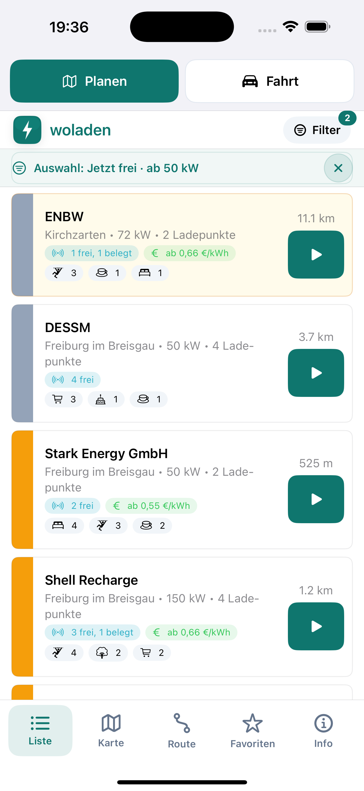

Zu prüfen:

- [ ] Der Planen/Fahrt-Umschalter ist sofort erkennbar.
- [ ] Gold/Silber/Bronze wird als durchgehender Balken links dargestellt.
- [ ] Entfernung, Live-Verfügbarkeit und Fahrtziel-Schaltfläche sind verständlich.

Selbstprüfung: Der Umschalter und die großen Fahrtziel-Schaltflächen sind
deutlich. Die Balken sind gut scanbar, bleiben ohne sichtbaren Stufennamen aber
farbabhängig.

Kommentar Human Review:

### S02 – Kartenansicht

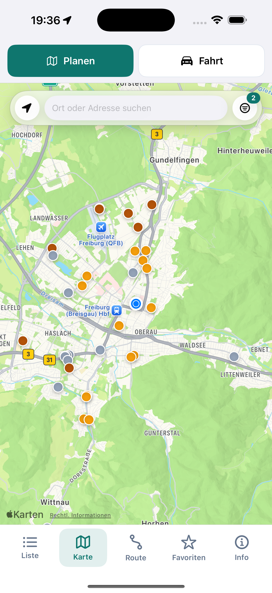

Zu prüfen:

- [ ] Die Bezeichnung „Kartenansicht“ und die Kartenaktionen sind verständlich.
- [ ] Suche, Filter und Standortfunktion konkurrieren nicht mit der Karte.

Selbstprüfung: Suche, Standort und Filter sind kompakt erreichbar. Der
Planen/Fahrt-Umschalter ist in diesem Zustand oben abgeschnitten; die vielen
überlappenden, nur farblich unterschiedenen Pins erschweren den Vergleich.

Kommentar Human Review:

### S03 – Stationsdetail mit Live-Daten und Angeboten

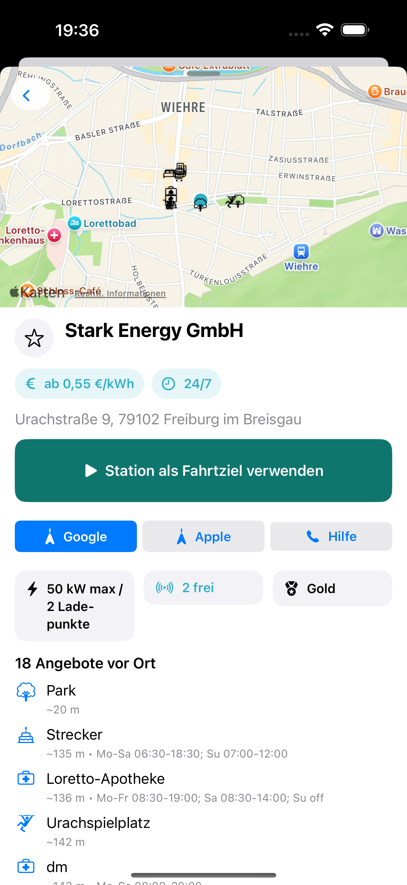

Zu prüfen:

- [ ] Qualitätsklasse, Ladeleistung, Ladepunkte und Live-Status sind vollständig.
- [ ] Zuverlässigkeit, letzter Ausfall und Auslastungsdaten sind auffindbar.
- [ ] Angebote und Öffnungszeiten sind brauchbar dargestellt.
- [ ] Station kann direkt als Fahrtziel verwendet werden.

Selbstprüfung: Das direkte Fahrtziel und die Angebote sind gut auffindbar.
Zuverlässigkeit, letzter Ausfall und Auslastungsstatistik fehlen sichtbar.
Google- und Apple-Schaltflächen nebeneinander schwächen außerdem die in S07
gewählte Navigationspräferenz.

Kommentar Human Review:

### S04 – Favorisierte Station

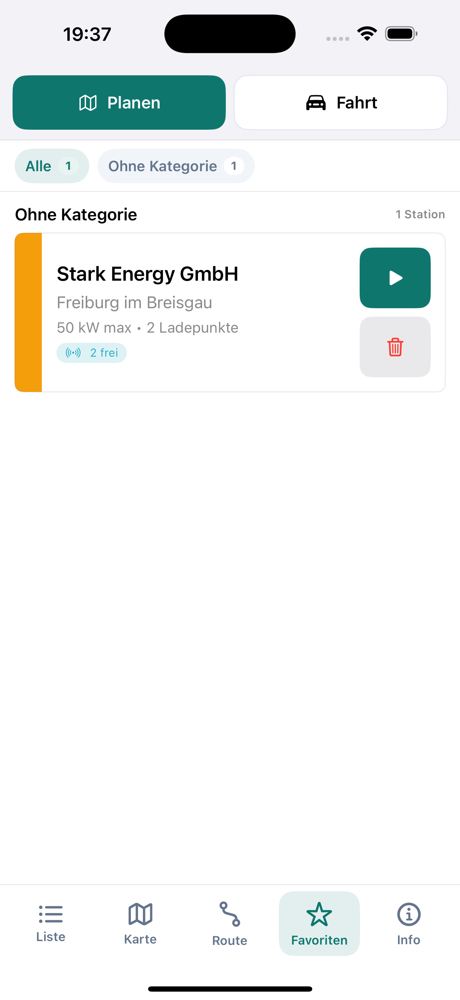

Zu prüfen:

- [ ] Qualitätsbalken und Fahrtziel-Schaltfläche entsprechen der Stationsliste.
- [ ] Entfernen und Starten der Fahrt sind nicht verwechselbar.

Selbstprüfung: Balken, Live-Status und Fahrtziel entsprechen der Liste.
Starten und Löschen sind räumlich getrennt, werden visuell aber nur durch
Symbole erklärt; die Stufe „Gold“ ist nicht ausgeschrieben.

Kommentar Human Review:

### S05 – Info, Einstellungen und Legende

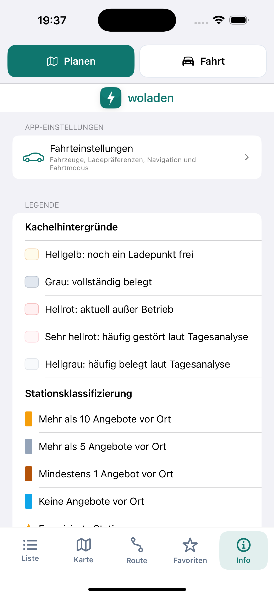

Zu prüfen:

- [ ] App- und Fahrteinstellungen sind über Info schnell erreichbar.
- [ ] Qualitätsbalken und Hintergrundfarben der Live-Zustände sind eindeutig erklärt.

Selbstprüfung: Der Zugang zu den Einstellungen ist klar. Die Legende erklärt
Farben und Schwellenwerte, benennt die resultierenden Stufen
Gold/Silber/Bronze jedoch nicht und benötigt eine nicht-farbliche Redundanz.

Kommentar Human Review:

### S06 – App- und Fahrteinstellungen

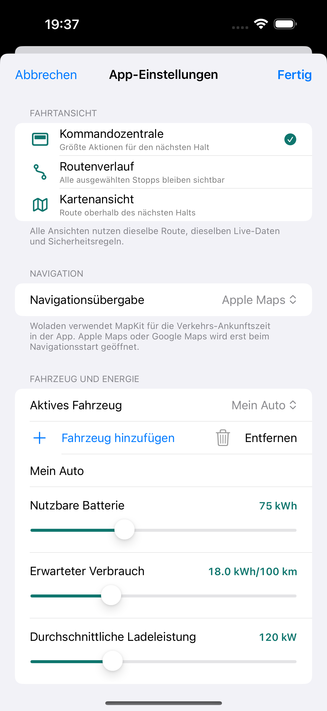

Zu prüfen:

- [ ] Kommandozentrale, Routenverlauf und Kartenansicht sind verständlich beschrieben.
- [ ] Mehrere Fahrzeuge können angelegt und das aktive Fahrzeug kann gewählt werden.
- [ ] Batteriekapazität, Verbrauch und Ladeleistung sind verständlich editierbar.

Selbstprüfung: Fahrtansicht, Navigation und Fahrzeugdaten sind sinnvoll
zentralisiert. Die Beschreibung der Kartenansicht widerspricht S17; für genaue
Fahrzeugwerte wären direkte Zahleneingaben zusätzlich zu Slidern robuster.

Kommentar Human Review:

### S07 – Navigations-App

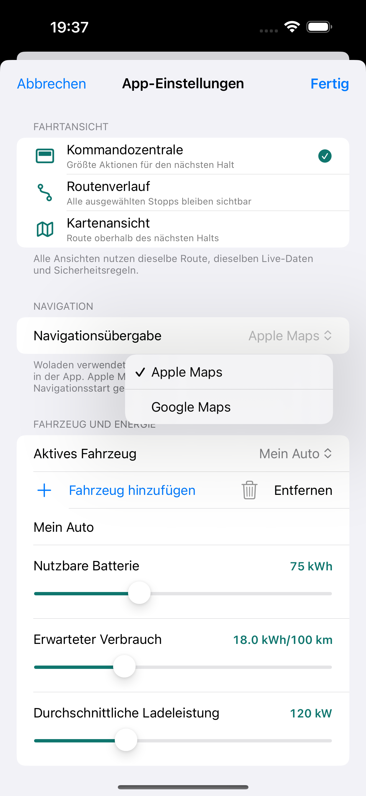

Zu prüfen:

- [ ] Apple Maps und Google Maps sind als dauerhafte Präferenz verständlich.
- [ ] Es ist klar, dass Woladen die Verkehrs-ETA selbst mit MapKit berechnet und die
      gewählte App erst beim Navigationsstart öffnet.

Selbstprüfung: Die Auswahl selbst ist eindeutig. Dieser Screenshot zeigt Apple
Maps, die späteren Fahrtzustände Google Maps; beide Zustände sind belegt, aber
nicht als eine lückenlose Einstellungssequenz zu verstehen.

Kommentar Human Review:

## Route planen

### S08 – Leere Routenverwaltung

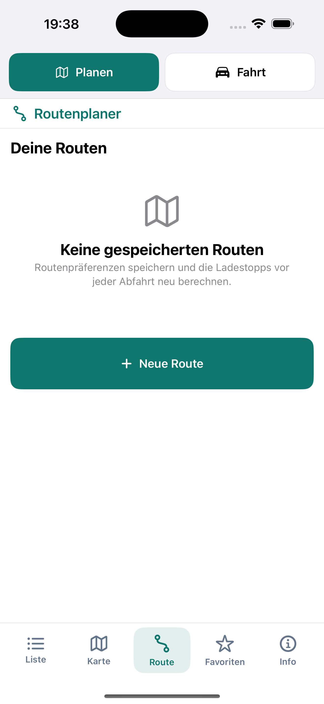

Zu prüfen:

- [ ] „Neue Route“ steht unter der Routenliste.
- [ ] Unter „Neue Route“ erscheinen ohne Auswahl keine Planungsfelder.

Selbstprüfung: Die leere Verwaltung ist angenehm reduziert und „Neue Route“
steht korrekt unter der Liste.

Kommentar Human Review:

### S09 – Neue Route

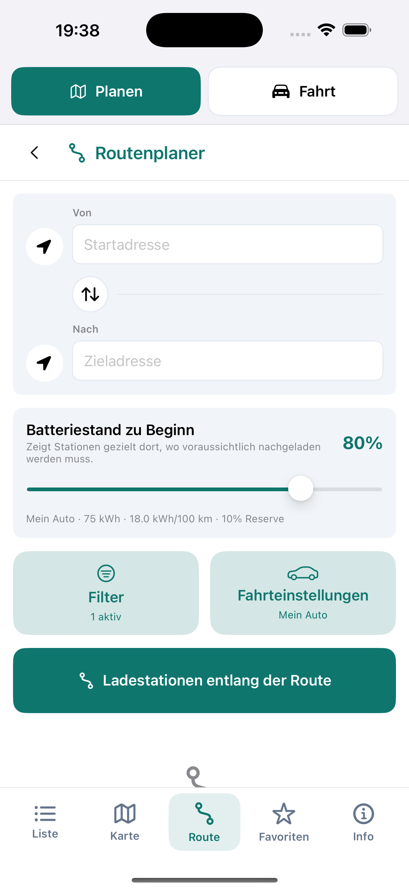

Zu prüfen:

- [ ] Reihenfolge: Start/Ziel, Batteriestand, Filter, Fahrteinstellungen,
      Routenberechnung.
- [ ] Filter und Fahrteinstellungen sind groß genug und klar voneinander getrennt.
- [ ] „Mein Standort“ wird nur als Aktion verwendet, nicht als gespeicherter Ortsname.

Selbstprüfung: Die gewünschte Reihenfolge ist umgesetzt. Nicht belegt sind hier
die Auflösung eines gespeicherten Startortes und die Neuberechnung von einem
abweichenden Standort; die graue Kurvenform direkt über der Tabbar wirkt wie
ein Layoutartefakt.

Kommentar Human Review:

### S10 – Erstes Ladefenster

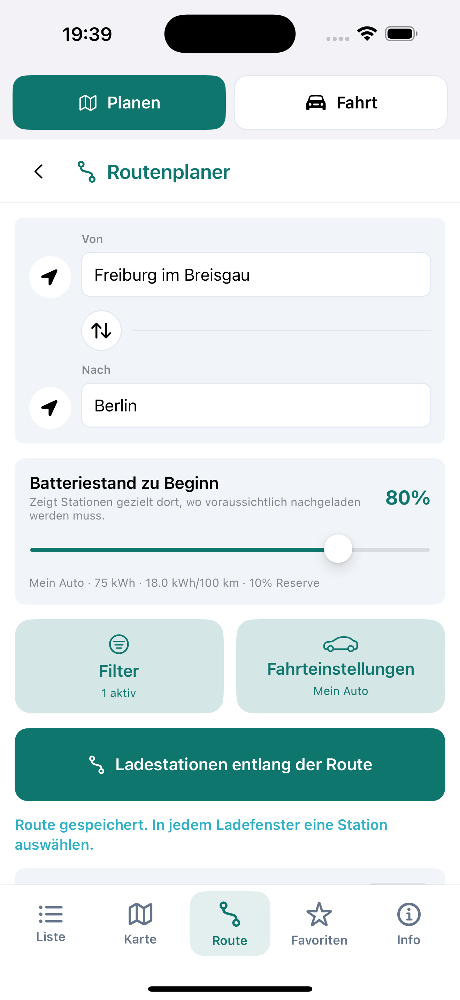

Zu prüfen:

- [ ] Nur Stationen um den voraussichtlichen Ladebedarf werden angeboten.
- [ ] Qualitätsklasse, Leistung, Ladepunkte, Umweg und Zuverlässigkeit helfen bei
      der Auswahl.
- [ ] Nicht gewählte Kandidaten bleiben als mögliche Ersatzstationen erkennbar.

Selbstprüfung: **Screenshot nicht akzeptiert.** Er endet vor den Kandidaten und
belegt daher weder Ladefenster, Stationsmerkmale noch Ersatzkandidaten.

Kommentar Human Review:

### S11 – Sequenzielles zweites Ladefenster

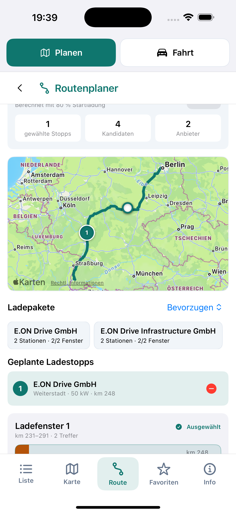

Zu prüfen:

- [ ] Das zweite Ladefenster wird ausgehend vom gewählten ersten Halt neu optimiert.
- [ ] Gewählter Halt und nächste Auswahl sind visuell klar getrennt.

Selbstprüfung: Die erste Wahl, Anbieterabdeckung und der Beginn des nächsten
Fensters sind erkennbar. Die vollständigen Kandidaten des zweiten Fensters
liegen außerhalb des Bildes; die sequenzielle Optimierung ist deshalb nur
teilweise belegt.

Kommentar Human Review:

### S12 – Startbereite Route

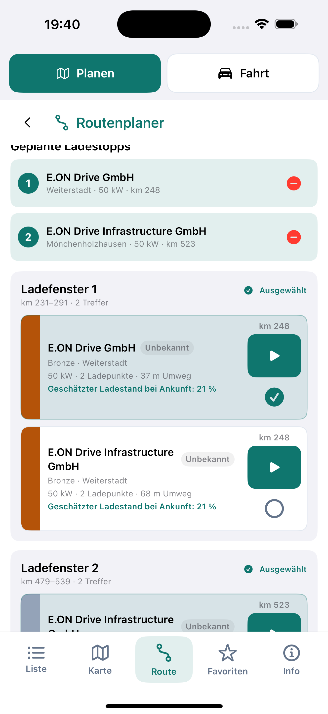

Zu prüfen:

- [ ] Beide gewählten Stopps und das Endziel sind in korrekter Reihenfolge sichtbar.
- [ ] Die Anbieterzählung unterstützt die Auswahl eines passenden Ladetarifs.
- [ ] Die Fahrt kann erst gestartet werden, wenn alle erforderlichen Stopps gewählt sind.

Selbstprüfung: **Screenshot nur teilweise akzeptiert.** Zwei ausgewählte Stopps
und Kandidaten sind sichtbar, aber Anbieterübersicht, Endziel und
„Fahrt starten“ fehlen im Bild. Für die Abnahme werden zwei ergänzende
Ausschnitte benötigt.

Kommentar Human Review:

### S18 – Gespeicherte Route

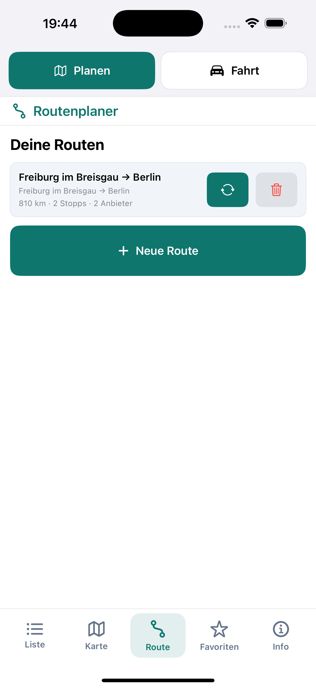

Zu prüfen:

- [ ] Aufgelöster Startort, Ziel, Distanz, Stopps und Anbieter sind verständlich.
- [ ] „Start und Batteriestand prüfen“ signalisiert die notwendige Neuberechnung.
- [ ] „Neue Route“ bleibt unter der Liste.

Selbstprüfung: Die gespeicherte Route enthält Ort, Ziel, Distanz, Stopps und
Anbieter; „Neue Route“ steht korrekt darunter. Der Kreispfeil erklärt die
notwendige Start-/Akkuprüfung ohne Text jedoch nicht ausreichend und
Start/Ziel werden in Titel und Untertitel doppelt gezeigt.

Kommentar Human Review:

### S19 – Routen und Stationen in Favoriten

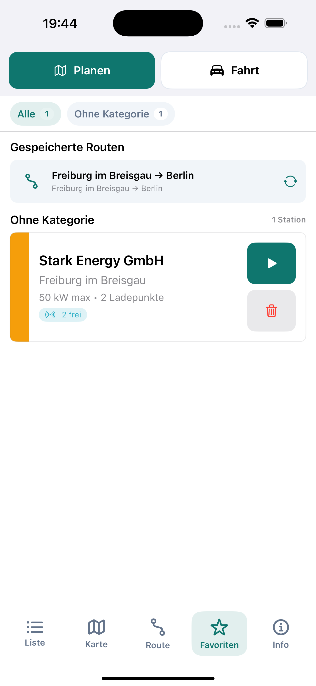

Zu prüfen:

- [ ] Gespeicherte Routen und favorisierte Stationen sind gemeinsam auffindbar.
- [ ] Die Route kann mit aktuellem Standort/Batteriestand neu berechnet werden.
- [ ] Die Station kann unabhängig von einer Route als Fahrtziel gestartet werden.

Selbstprüfung: Die gemeinsame Ablage von Route und Station ist schlüssig. Die
Kreispfeil- und Play-Aktionen brauchen sichtbare Kurzlabels oder müssen in
einem Bedienbarkeitstest eindeutig verstanden werden.

Kommentar Human Review:

## Fahrt

### S13 – Kommandozentrale

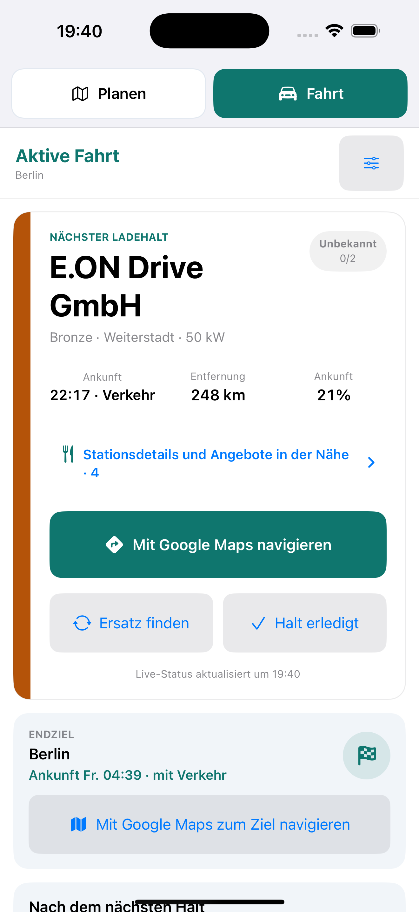

Zu prüfen:

- [ ] Nächster Ladestopp bleibt mit Qualitätsbalken und Stationsdaten im Fokus.
- [ ] Verkehrs-ETA, Entfernung, erwarteter Batteriestand und Endziel sind sichtbar,
      ohne vorher die externe Navigation zu starten.
- [ ] Google Maps, Ersatzsuche und „Halt erledigt“ sind während der Fahrt leicht
      erreichbar.

Selbstprüfung: Nächster Halt, Verkehrs-ETA, Endziel und große Aktionen sind gut
priorisiert. „Ankunft“ wird für Uhrzeit und Akkustand doppelt verwendet;
`Unbekannt 0/2` ist missverständlich, und die sehr hohe Karte verdrängt einen
Teil des weiteren Routenverlaufs.

Kommentar Human Review:

### S14 – Aufgeklappte Stationsdetails

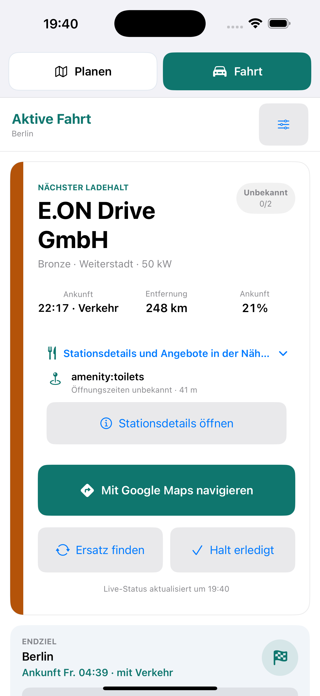

Zu prüfen:

- [ ] Der kompakte Fahrtbildschirm bleibt standardmäßig aufgeräumt.
- [ ] Angebote, Öffnungszeiten und vollständiges Stationsdetail sind bei Bedarf
      erreichbar.

Selbstprüfung: Das Aufklappen hält den Grundzustand ruhig. Der Rohwert
`amenity:toilets` ist nicht nutzerfertig lokalisiert und der Disclosure-Titel
wird sichtbar abgeschnitten.

Kommentar Human Review:

### S15 – Ersatzstation

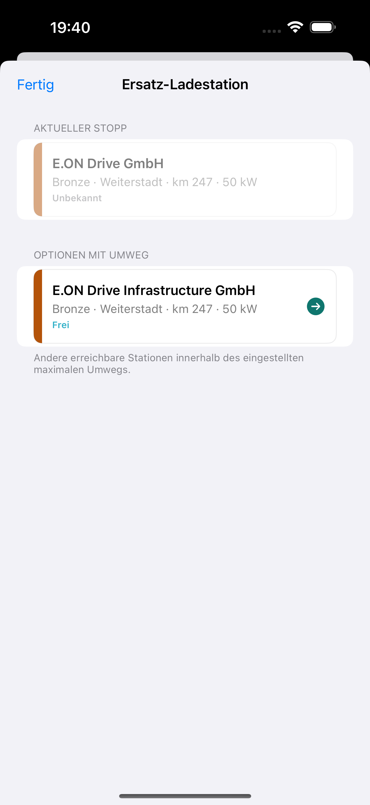

Zu prüfen:

- [ ] Aktueller Halt und Ersatzkandidaten sind nicht verwechselbar.
- [ ] Live-Verfügbarkeit und Qualitätsklasse reichen für eine schnelle Entscheidung.
- [ ] Der Ersatz kann mit möglichst wenigen Interaktionen übernommen werden.

Selbstprüfung: Aktueller Halt und Alternative sind strukturell getrennt. Für
eine sichere Entscheidung fehlen zusätzlicher Umweg beziehungsweise ETA,
Ankunfts-Akkustand, Ladepunktzahl, Zuverlässigkeit und eine beschriftete Aktion
„Als Ersatz übernehmen“.

Kommentar Human Review:

### S16 – Routenverlauf

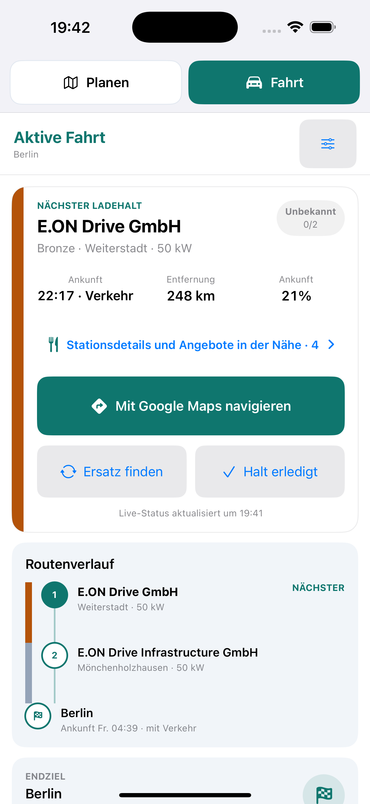

Zu prüfen:

- [ ] Alle gewählten Stopps und das Endziel bleiben in Fahrtrichtung sichtbar.
- [ ] Gold/Silber/Bronze-Balken sind auch im Fahrtmodus konsistent.
- [ ] Nächster Halt und bereits folgende Stopps sind eindeutig unterscheidbar.

Selbstprüfung: Die vertikale Reihenfolge und die Klassifizierungsbalken
funktionieren. Beim zweiten Halt fehlen Verkehrs-ETA, erwarteter Akkustand und
Live-Status, wodurch der Verlauf nur eingeschränkt vorausschauend nutzbar ist.

Kommentar Human Review:

### S17 – Kartenansicht mit Station zuerst

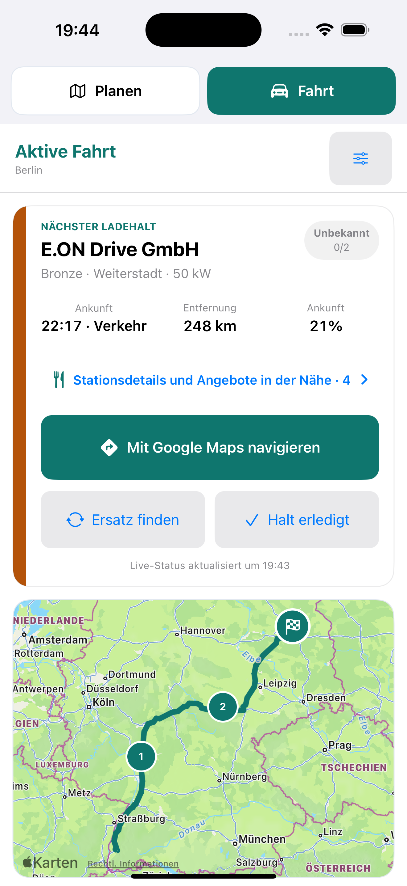

Zu prüfen:

- [ ] Die Informationen zum nächsten Halt stehen oberhalb der Karte.
- [ ] Route, Ladestopps und Endziel sind auf der Karte verständlich.
- [ ] Die Karte verdrängt die sicherheitsrelevanten Aktionen nicht.

Selbstprüfung: Die Station steht wie gefordert oberhalb der Karte und die
sicherheitsrelevanten Aktionen bleiben sichtbar. Die Einstellungsbeschreibung
in S06 muss dieser tatsächlich richtigen Reihenfolge angepasst werden.

Kommentar Human Review:

### S20 – Favorisierte Station als einziges Fahrtziel

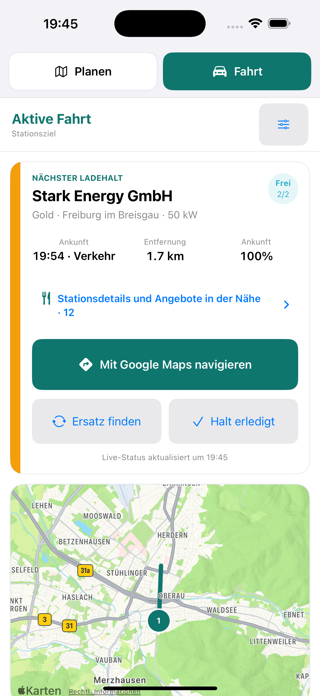

Zu prüfen:

- [ ] „Stationsziel“ ist ohne separates Endziel eindeutig.
- [ ] Verkehrs-ETA und Live-Daten werden ohne gestartete externe Navigation angezeigt.
- [ ] Ersatzsuche und vollständige Stationsdetails bleiben verfügbar.

Selbstprüfung: Das einzelne Stationsziel funktioniert ohne Endziel und zeigt
Live-Status sowie Verkehrs-ETA. `100%` kollidiert sichtbar mit der Entfernung;
beide Metriken heißen „Ankunft“, und „Halt erledigt“ sollte für ein einzelnes
Ziel sprachlich überprüft werden.

Kommentar Human Review:

## Vorprüfung Barrierefreiheit und Fahrsicherheit

Aus den Screenshots positiv erkennbar:

- Der Planen/Fahrt-Umschalter und die primären Fahrtaktionen haben große
  Berührungsflächen.
- Überschriften, Stationsname, ETA und Endziel besitzen im Fahrtmodus eine klare
  visuelle Hierarchie.
- Live-Zustand und Klassifizierung werden im Fahrtmodus nicht ausschließlich
  durch den Kartenpunkt dargestellt, sondern zusätzlich textlich benannt.

Sichtbare Risiken:

- S01, S02, S04, S05 und S19 nutzen Farbe als wesentlichen Informationsträger.
- Mehrere graue Sekundärtexte und Statusflächen wirken kontrastarm; Messwerte
  müssen mit einem Kontrasttest geprüft werden.
- S20 zeigt bereits bei der getesteten Standarddarstellung einen Reflow-Fehler.
  Größere Dynamic-Type-Stufen sind daher ein Pflichtest.
- S14 schneidet einen wichtigen Disclosure-Titel ab.
- Symbolaktionen für Start, Neuberechnung und Löschen sind ohne sichtbare
  Beschriftung nicht für alle Nutzer eindeutig.
- „Halt erledigt“ liegt direkt neben „Ersatz finden“. Bestätigung, Sperren
  während Bewegung und CarPlay-Verhalten müssen als Sicherheitsablauf geprüft
  werden.

Nicht aus Screenshots bestätigbar sind VoiceOver-Namen und -Reihenfolge,
Rotorverhalten, Fokus nach Moduswechsel, Dynamic Type, Kontrastwerte,
Bewegungsreduktion sowie Bedienbarkeit mit Switch Control.

## Noch als Realtest offen

Diese Zustände wurden bewusst nicht mit erfundenen Daten dargestellt:

- [ ] **Belegte Station:** Im verfügbaren Live-Datensatz war der aktive nächste Halt
      nicht belegt. Zu prüfen ist, ob „Belegt“ den Wert „Ankunft %“ ersetzt und die
      Karte die in der Legende definierte Hintergrundfarbe erhält.
- [ ] **Minütliche Aktualisierung:** Zeitstempel und wiederholter Live-Abruf sind
      sichtbar; das Verhalten über mehrere Minuten sollte auf dem Gerät protokolliert
      werden.
- [ ] **CarPlay:** Benötigt CarPlay-Entitlement beziehungsweise einen
      CarPlay-Simulator oder ein Fahrzeugdisplay. Bedienflächen, Fokus und
      Sicherheitsgrenzen müssen dort separat abgenommen werden.
- [ ] **Externe Navigation:** Übergabe an Apple Maps und Google Maps einschließlich
      Rückkehr zur aktiven Woladen-Fahrt auf einem Gerät prüfen.

Kommentar zu den offenen Realtests:
